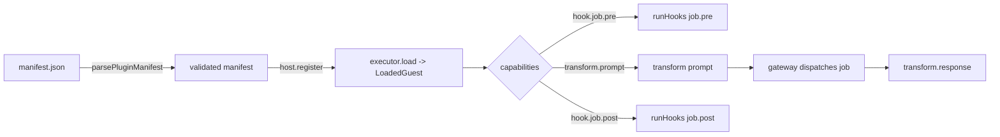

# @ubag/plugins

WASM plugin host and SDK for UBAG. Plugins extend two surfaces without touching
the gateway core:

- **Job lifecycle hooks** — `hook.job.pre` and `hook.job.post`.
- **Payload transforms** — `transform.prompt` (before dispatch) and
  `transform.response` (response normalization).

## Why WASM

Plugins are untrusted, third-party code. WebAssembly gives us a deny-by-default
sandbox: a guest cannot touch the network, filesystem, environment, or clock
unless the host explicitly links an import for it. UBAG layers a manifest-driven
permission allowlist on top so capabilities are declared, reviewable, and
enforced at the host boundary.

## Manifest

Every plugin ships a manifest validated against
[`schema/plugin-manifest.schema.json`](schema/plugin-manifest.schema.json) and
[`parsePluginManifest`](src/manifest.ts). It declares metadata, capabilities,
the component-model entrypoints, and an explicit permission grant:

```jsonc
{
  "schema_version": "ubag.plugin.v0",
  "id": "response-normalizer",
  "display_name": "Response Normalizer",
  "version": "0.1.0",
  "entrypoint": {
    "type": "wasi-component",
    "module": "build/response_normalizer.wasm",
    "exports": { "transform": "transform" }
  },
  "capabilities": ["transform.response"],
  "permissions": {
    "host_functions": ["log", "clock"],
    "max_memory_bytes": 16777216,
    "max_execution_ms": 500
  },
  "engine": { "runtime": "wasi-preview2", "min_host_version": "0.0.0" }
}
```

Anything not listed is denied. Network/filesystem/env access additionally
requires the matching host function (`fetch` / `read_file` / `get_env`) **and**
an explicit allowlist (`allowed_hosts` / `allowed_paths` / `allowed_keys`).

## Security sandbox model

The sandbox enforces, in layers:

1. **Manifest validation** — unknown capabilities, unknown host functions, and
   inconsistent permission grants (e.g. an allowlist without `allowed: true`)
   are rejected before a plugin is ever loaded.
2. **Capability gating** — [`buildGuestContext`](src/permissions.ts) builds the
   per-invocation context. Host functions the manifest did not request resolve
   to stubs that throw `PermissionDeniedError`.
3. **Resource allowlists** — granted `fetch`/`read_file`/`get_env` calls are
   wrapped to enforce host, path-traversal-safe path, and env-key allowlists at
   call time.
4. **Execution budget** — each invocation is bounded by `max_execution_ms`. The
   reference runtime (wazero) enforces this with epoch-based interruption; the
   mock executor enforces it via the injected clock.
5. **Memory ceiling** — `max_memory_bytes` caps guest linear memory in the real
   runtime.

## Host runtime

[`PluginHost`](src/host.ts) orchestrates plugins. It is backed by a
[`WasmExecutor`](src/host.ts):

| Environment | Executor | Runtime binding |
| --- | --- | --- |
| **Production (Go gateway)** | `WazeroExecutor` (to be added in the gateway) | [`wazero`](https://github.com/tetratelabs/wazero) — pure-Go, no cgo |
| **Production (TS services)** | `WasmerExecutor` | [`@wasmer/wasi`](https://github.com/wasmerio/wasmer-js) |
| **Tests / offline dev** | [`MockWasmExecutor`](src/host.ts) | none — resolves an in-memory `GuestModule` |

The `MockWasmExecutor` does **not** parse `.wasm`. It maps a manifest to a JS
`GuestModule` (see the examples) so the full host pipeline — manifest parsing,
permission enforcement, capability dispatch, hook short-circuiting, and timeout
handling — is exercised deterministically with no toolchain. Swapping in a real
runtime only requires implementing the `WasmExecutor.load` interface; the
permission and orchestration layers are runtime-agnostic.

## Plugin lifecycle



- `transform(target, value)` chains every plugin declaring `transform.<target>`
  in registration order, threading each output into the next.
- `runHooks(event, payload)` runs every plugin declaring `hook.job.<event>`. The
  first `reject` short-circuits so the gateway can fail the job.

## Examples

- [`examples/response-normalizer`](examples/response-normalizer) — a
  `transform.response` plugin (granted `log`, `clock`).
- [`examples/prompt-template`](examples/prompt-template) — a `transform.prompt`
  + `hook.job.pre` plugin (granted `log` only).

Each example ships guest source plus a `BUILD.md` describing how to compile to a
WASI component with `jco componentize` (JS/TS) or `cargo component` (Rust).

## Gateway wiring (future)

The Go gateway is intentionally untouched. To adopt plugins it would:

1. Add a `WazeroExecutor` implementing this package's `WasmExecutor` contract
   (manifest → instantiated `wazero` module).
2. Build a `PluginHost` at startup from manifests discovered under a plugins
   directory.
3. Call `runHooks("job.pre", ...)` and `transform("prompt", ...)` before
   dispatching a job, then `transform("response", ...)` and
   `runHooks("job.post", ...)` on completion.
4. Surface `PluginError.code` values into job telemetry.

## Commands

```bash
pnpm --filter @ubag/plugins typecheck   # tsc --noEmit over src/**/*.ts
pnpm --filter @ubag/plugins test        # node --test (Node 24 strips TS types)
```
